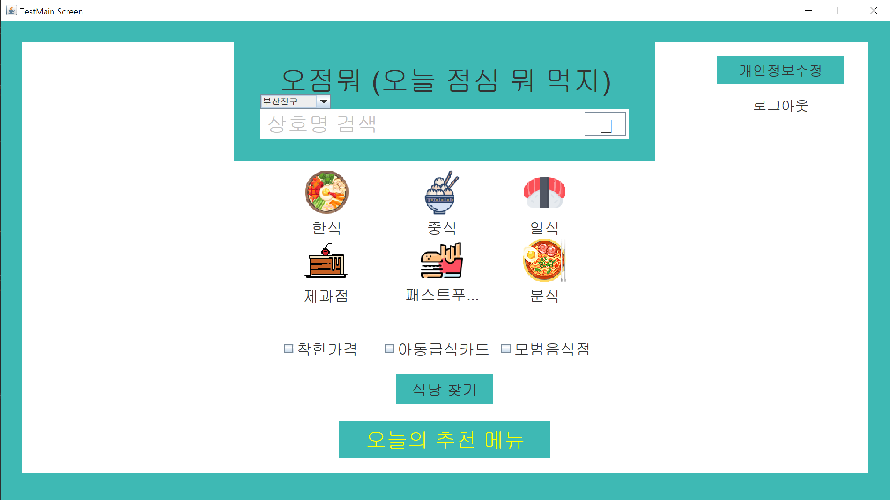
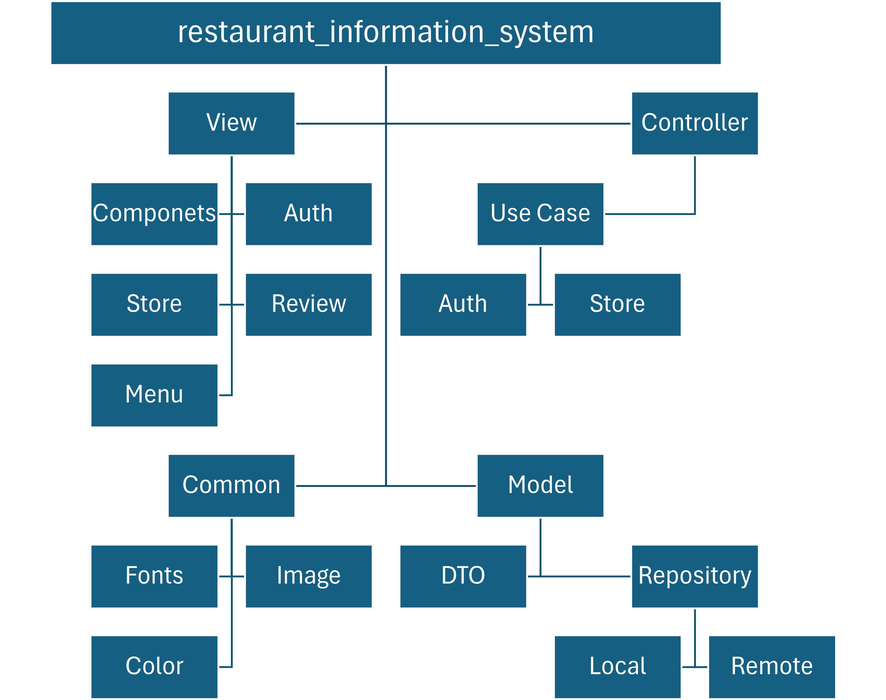

# 음식점 정보 시스템 (Restaurant Information System)

> 해당 프로젝트는 동의대학교 2022학년도 2학기 객체지향프로그래밍Ⅱ 수업의 텀프로젝트로 진행되었습니다.
>
> 해당 브런치는 리팩토링된 브런치로써 기존 프로젝트는 [여기](https://github.com/cmsong111/Restaurant-information-system/tree/main)에서 확인하실 수 있습니다.

# 📌 프로젝트 소개

**음식점 정보 시스템은 음식점의 정보를 관리하는 시스템입니다.**

해당 시스템은 음식점의 정보를 등록, 수정, 삭제, 검색할 수 있으며, 음식점의 정보는 음식점의 이름, 주소, 전화번호, 음식점의 메뉴, 가격, 음식점의 리뷰, 평점으로 구성되어 있습니다.

또한, 해당 시스템은 음식점의 정보를 서버에 저장하고, 서버에 저장된 음식점의 정보를 불러올 수 있습니다.

서버는 [음식점 정보 시스템 백엔드 시스템](https://github.com/cmsong111/Restaurant-information-system-server)과 통신하도록 구현되었습니다.

# 📌 프로젝트 아키텍쳐

해당 프로젝트는 Java Swing 라이브러리를 활용하여 개발되었습니다.

따라서 다음과 같이 MVC 패턴을 적용하여 구현되었습니다.

- **Model**: 데이터를 처리하는 클래스를 모아놓은 패키지
- **View**: 사용자에게 보여지는 화면을 구성하는 클래스를 모아놓은 패키지
- **Controller**: 사용자의 입력을 받아 Model과 View를 연결하는 클래스를 모아놓은 패키지
- **Common**: 공통으로 사용되는 리소스 및 클래스를 모아놓은 패키지

# 📌 프로젝트에 적용된 라이브버리

- **Retrofit2**: 서버와 통신을 위한 라이브러리
    - **Gson**: JSON 데이터를 자바 객체로 변환하기 위한 라이브러리
- **Dokka**: 문서화를 위한 라이브러리
- **SLF4J**: 로깅을 위한 라이브러리
    - **Logback**: SLF4J의 구현체
- **Lombok**: 코드를 간결하게 작성하기 위한 라이브러리
 
  *(Java->Kotlin으로 전환하면서 제거 예정)*
